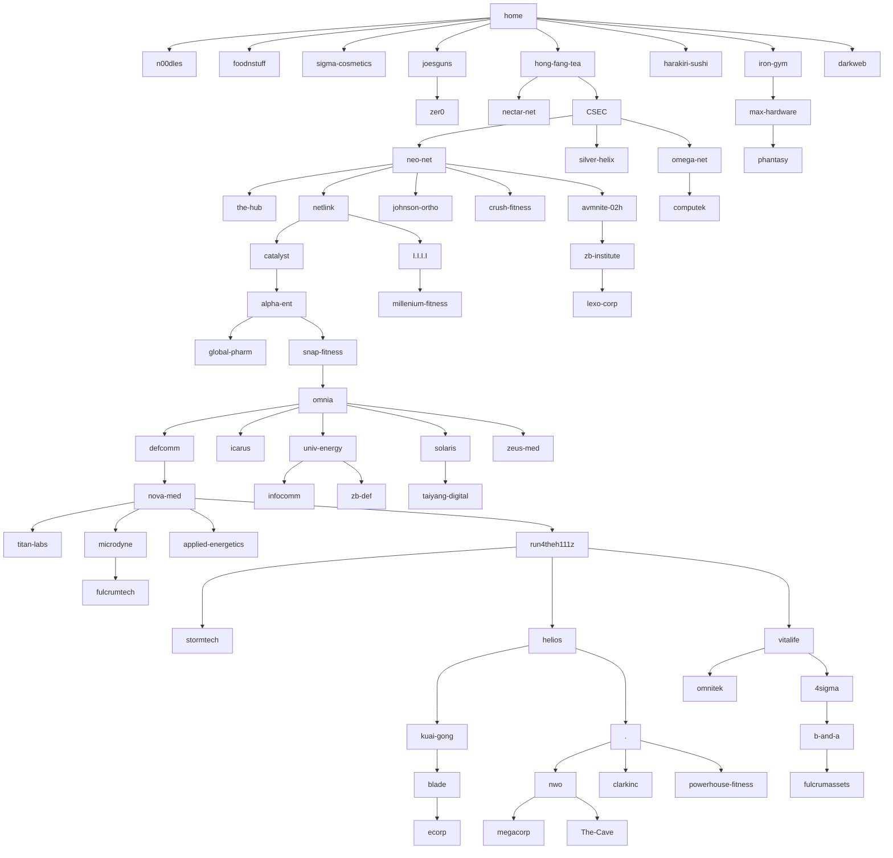

### Server network map for the Bitburner game at https://danielyxie.github.io/bitburner/

```mermaid
flowchart TB
  home --> n00dles
  home --> foodnstuff
  home --> sigma-cosmetics
  home --> joesguns
  home --> hong-fang-tea
  home --> harakiri-sushi
  home --> iron-gym
  home --> darkweb
  
  joesguns --> zer0
  
  hong-fang-tea --> nectar-net
  hong-fang-tea --> CSEC
  
  iron-gym --> max-hardware
  
  max-hardware --> phantasy
  
  CSEC --> neo-net
  CSEC --> silver-helix
  CSEC --> omega-net
  
  neo-net --> the-hub
  neo-net --> netlink
  neo-net --> johnson-ortho
  neo-net --> crush-fitness
  neo-net --> avmnite-02h
  
  omega-net --> computek
  
  avmnite-02h --> zb-institute
  
  netlink --> catalyst
  netlink --> I.I.I.I
  
  zb-institute --> lexo-corp
  
  I.I.I.I --> millenium-fitness
  
  catalyst --> alpha-ent
  
  alpha-ent --> global-pharm
  alpha-ent --> snap-fitness
  
  snap-fitness --> omnia
  
  omnia --> defcomm
  omnia --> icarus
  omnia --> univ-energy
  omnia --> solaris
  omnia --> zeus-med
  
  defcomm --> nova-med
  
  univ-energy --> infocomm
  univ-energy --> zb-def
  
  solaris --> taiyang-digital
  
  nova-med --> titan-labs
  nova-med --> microdyne
  nova-med --> applied-energetics
  nova-med --> run4theh111z
  
  microdyne --> fulcrumtech
  
  run4theh111z ---> stormtech
  run4theh111z ---> helios
  run4theh111z ---> vitalife
  
  helios ---> kuai-gong
  helios ---> .
  
  vitalife --> omnitek
  vitalife --> 4sigma
  
  4sigma --> b-and-a --> fulcrumassets
    
  kuai-gong --> blade --> ecorp
  
  . --> nwo & clarkinc & powerhouse-fitness
  
  nwo --> megacorp & The-Cave
```
